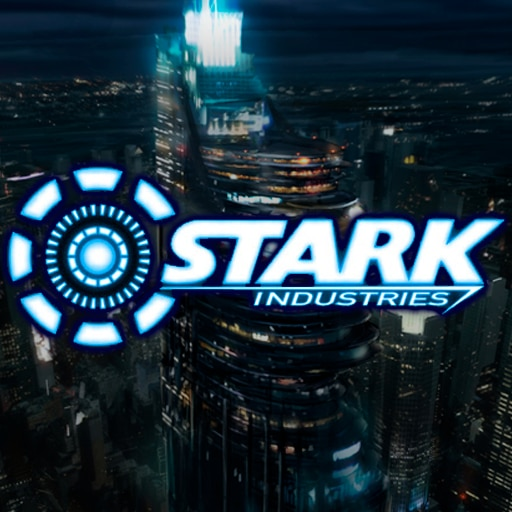

# Stark Industries

## 팀명: PJ

### 팀원

- **장건희**: 스타크 인더스트리의 CTO
- **박양하**: 스타크 인더스트리의 잡부

## 📌 프로젝트 개요

Stark Industries는 혁신적인 기술을 기반으로 미래를 선도하는 기업입니다. 본 프로젝트는 PJ 팀이 주도하여 진행하며, 다양한 기술 개발과 연구를 수행합니다.

## 🚀 주요 기능

- **최첨단 AI 연구**
- **혁신적인 로봇 공학**
- **차세대 에너지 기술 개발**

## 📂 프로젝트 구조

```bash
📦 프로젝트 폴더
 ┣ 📂 src              # 소스 코드
 ┣ 📂 docs             # 문서 자료
 ┣ 📂 assets           # 이미지 및 리소스
 ┣ 📜 README.md        # 프로젝트 소개 문서
 ┗ 📜 .gitignore       # Git 무시 파일
```

## 🔧 기술 스택

- **프로그래밍 언어**: Python, JavaScript, C++
- **프레임워크**: React, Django, Flask
- **데이터베이스**: PostgreSQL, SQLite

## 📄 라이선스

이 프로젝트는 MIT 라이선스를 따릅니다. 자유롭게 사용하세요!
